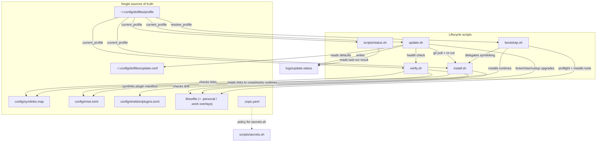

# Architecture

How the pieces fit together: a small set of lifecycle scripts read a few
**single-source-of-truth (SSOT)** files and reshape a machine according to its
[profile](profiles.md). This page is the mental model — what each script does,
where the SSOT files are consumed, and how a change flows from one file to every
consumer.

## The big picture



## Lifecycle scripts

The repo is driven by five scripts. Each is safe to re-run (idempotent) and
reads the active profile so it only touches the components that profile
includes.

### `bootstrap.sh` — one-time setup on a fresh Mac

Installs everything and links your dotfiles. It runs a 14-step sequence:
Xcode CLT → Homebrew → `brew bundle` (profile Brewfiles) → fzf integration →
SSH signing key → `gh` auth → mise runtimes → Corepack/Yarn → Rust → TPM note →
git-lfs → **dotfile symlinks (delegates to `install.sh`)** → work configs (work
profile) → macOS defaults (GUI profiles).

On a genuine first run (no `--profile`, no `DOTFILES_PROFILE`, no persisted
profile file, interactive TTY, not a dry-run) it shows the **first-run picker**
to choose `personal` / `work` / `minimal` / `server`, then persists the choice.

```sh
bash bootstrap.sh                 # interactive, picks/uses a profile
bash bootstrap.sh --profile work  # force a profile
bash bootstrap.sh --dry-run       # preview every step, change nothing
bash bootstrap.sh --skip-preflight
```

Before any changes it runs [`scripts/preflight.sh`](DRY_RUN_AND_PREFLIGHT.md)
(OS, arch, disk, network, conflicting package managers, existing dotfiles, …).
Critical errors abort; warnings prompt to continue.

### `install.sh` — symlink dotfiles into `$HOME`

The symlink engine. It resolves `current_profile`, reads
[`config/symlinks.map`](#configsymlinksmap), and for each record that applies to
the profile creates `~/<dest> → <repo>/<src>`. Existing real files are moved to a
timestamped backup under `~/.dotfiles_backup/<date>/` before linking.

It also performs the **non-symlink** setup that does not belong in the map: the
thin `~/.gitconfig` include (see below), seeding `~/.config/git/local.gitconfig`,
the global `pre-commit` hook, and VS Code settings/extensions.

```sh
zsh install.sh   # re-link for the current profile (run after editing the map)
```

### `update.sh` — keep everything current

The daily maintenance script. Seven steps:

1. **Dotfiles** — `git pull --rebase --autostash` (skipped if the tree is dirty
   unless `--force-pull`; an interrupted rebase is auto-aborted).
2. **Symlinks** — re-run `install.sh` to pick up new/renamed links.
3. **Homebrew** — `brew update && upgrade && autoremove && cleanup`.
4. **Runtimes** — `mise upgrade`.
5. **Rust** — `rustup update`.
6. **Ruby gems / uv tools** — `gem update --system`, `uv tool upgrade --all`.
7. **Health check** — runs `verify.sh`.

Steps are individually fault-tolerant: a failure is recorded, not fatal, and the
run finishes. On completion it writes `logs/update.status` and, on failure,
posts a macOS notification.

```sh
bash update.sh              # full update
bash update.sh --no-upgrade # pull + re-symlink + verify only (pinned tooling)
bash update.sh --no-pull    # skip git pull
bash update.sh --dry-run    # preview, change nothing
```

Schedule it daily via launchd with
[`scripts/setup-scheduler.sh`](troubleshooting.md#scheduled-updates).

### `verify.sh` — read-only health check

Nine checks: broken symlinks (the only **error**, exit 1), required tools,
stale backups, SSH key, git-lfs global init, mise runtimes installed, dotfiles
git health (conflict markers / parseable git config), Brewfile drift, and the
`~/.gitconfig` include. Everything except broken symlinks is a non-fatal
warning. `update.sh` calls it automatically as its final step.

```sh
bash verify.sh
```

### `scripts/status.sh` — quick snapshot (`dotstatus`)

Read-only and fast. Prints the repo's git state (branch, dirty/untracked,
ahead/behind) plus the result of the last `update.sh` run (read from
`logs/update.status`). Aliased to `dotstatus`.

```sh
bash scripts/status.sh             # repo + last-update summary
bash scripts/status.sh --verify    # also run the full verify.sh
bash scripts/status.sh --exit-code # non-zero exit if unhealthy (for scripting)
```

## The profile system

A [**profile**](profiles.md) is the durable identity of a machine
(`minimal` / `personal` / `work` / `server`), persisted at
`~/.config/dotfiles/profile`. The pure helpers in
[`scripts/lib/profile_helpers.sh`](https://github.com/bradbergeron-us/dotfiles/blob/main/scripts/lib/profile_helpers.sh)
(`resolve_profile`, `current_profile`, `profile_includes`, `profile_brewfiles`,
…) are shared by every lifecycle script, so the active profile gates the same
components everywhere — package overlays, profile-tagged symlinks, work configs,
and macOS defaults. See [Machine Profiles](profiles.md) for the full tag rules.

## Single sources of truth

The design goal is **one place to change each thing**. Every consumer reads the
same file, so adding a tracked dotfile, a runtime, or a plugin is a one-line
edit that the whole toolchain picks up.

### `config/symlinks.map`

The manifest of tracked dotfile symlinks — one `<src> <dest> [tags]` record per
line. `src` is relative to the repo, `dest` is relative to `$HOME`, and the
optional `tags` column (`gui`, `work`, a profile name, or blank for all) gates
which profiles get the link.

Consumed by `install.sh` (creates the links), `verify.sh` (checks them),
`bootstrap.sh --dry-run` (previews them), and the CI install-smoke job. Add a
tracked dotfile by adding one line here — every consumer picks it up.

!!! note "Bespoke, not in the map"
    The `~/.gitconfig` thin include, `local.gitconfig` seed, global pre-commit
    hook, and VS Code settings are intentionally **not** symlinks. They live as
    bespoke logic in `install.sh`.

### `config/mise.toml`

The runtime version manifest (`node`, `ruby`, `java`, `python`, `go`).
`bootstrap.sh` parses it to install runtimes; `verify.sh` checks they are
installed; `mise` itself reads the symlinked copy at `~/.config/mise/config.toml`
for automatic per-project version switching.

### `config/sheldon/plugins.toml`

The declarative zsh plugin manifest for [sheldon](glossary.md#sheldon).
Symlinked to `~/.config/sheldon/plugins.toml` and sourced from `home/zshrc` via
`eval "$(sheldon source)"`. Add a `[plugins.<name>]` block to add a plugin on
every machine.

### `Brewfile` and overlays

The core `Brewfile` plus the `Brewfile.personal` (GUI) and `Brewfile.work`
overlays. `profile_brewfiles` decides which files apply: core always, `.personal`
for GUI profiles, `.work` for the work profile. `bootstrap.sh` installs from this
list; `verify.sh` checks the same list for drift.

### `.sops.yaml`

The encryption policy for [sops + age](secrets.md): `creation_rules` map file
paths (`path_regex`) to age recipients (public keys). `scripts/secrets.sh` and
`sops` read it to decide which files to encrypt and for whom. See
[Encrypted Secrets](secrets.md).

### `~/.config/dotfiles/update.conf`

Per-machine defaults for `update.sh` (e.g. `NO_UPGRADE=true`). Read **directly**
by `update.sh` on every run — crucial because the scheduled launchd job does not
source your shell rc, so an env var in `~/.zshrc` would never reach it. Precedence
is config file < environment variables < command-line flags.

### The thin `~/.gitconfig` include

`~/.gitconfig` is a **real file**, not a symlink. `install.sh` writes a tiny file
that `[include]`s the tracked `home/gitconfig`. Keeping it a real file means
`git config --global …` and tools like `gh auth setup-git` write into your local
file (overriding shared defaults on that machine only) instead of corrupting the
tracked repo file. `verify.sh` confirms the include is intact.

## Where to go next

- [Machine Profiles](profiles.md) — the tag rules behind every gate above.
- [Troubleshooting](troubleshooting.md) — what to do when a step fails.
- [Glossary](glossary.md) — definitions for the terms used here.
- The **How-to guides** section — task-oriented recipes (add a tracked dotfile,
  add a package, rotate a secret, add a zsh plugin, recover from a failed update).
