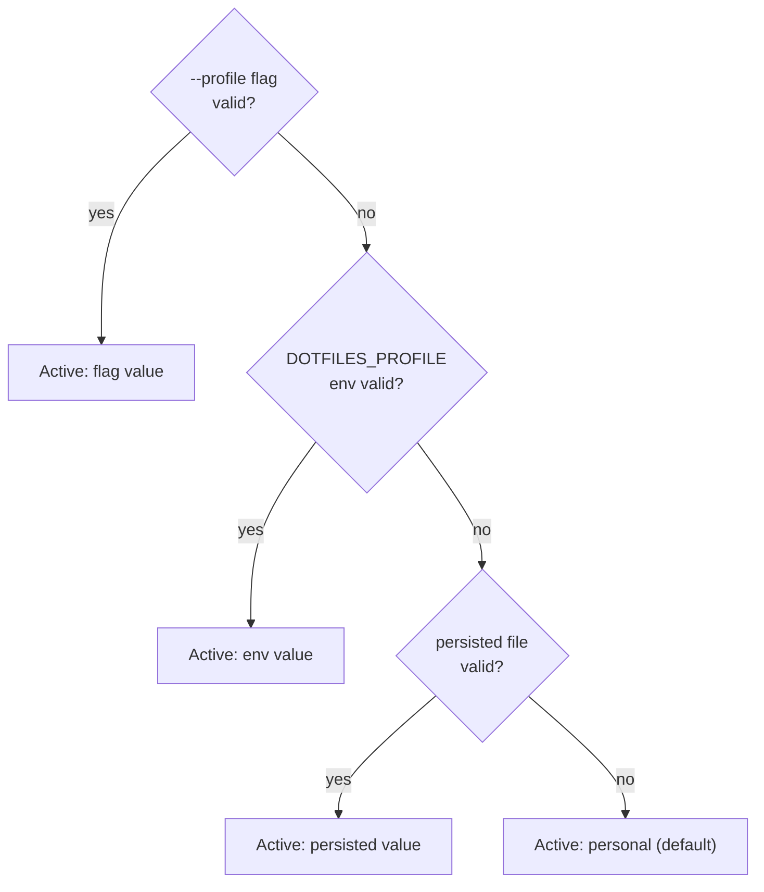

# Machine Profiles

A **profile** is the durable identity of a managed machine. One shared repo can
serve several distinct devices — a personal laptop, a work laptop, a headless
server — by selecting which packages, dotfiles, and setup steps apply. The
active profile is persisted at `~/.config/dotfiles/profile` and honored by
`bootstrap.sh`, `install.sh`, `update.sh`, `verify.sh`, and `scripts/status.sh`.

The logic lives in [`scripts/lib/profile_helpers.sh`](https://github.com/bradbergeron-us/dotfiles/blob/main/scripts/lib/profile_helpers.sh) —
small, side-effect-free helpers (`valid_profile`, `resolve_profile`,
`current_profile`, `persist_profile`, `profile_includes`, `profile_brewfiles`,
`profile_component_summary`) that every consumer shares, so a profile gates the
same components everywhere.

## The four profiles

There are four canonical profiles: `minimal`, `personal`, `work`, and `server`.
`personal` and `work` map to real managed devices today; `minimal` and `server`
are presets (and CI fixtures).

- **`minimal`** — core CLI toolchain + runtimes (mise) + core dotfiles only. No
  GUI casks/apps, no work overlay, no macOS defaults.
- **`personal`** (default) — everything in `minimal`, plus GUI casks/fonts/apps
  (the `Brewfile.personal` overlay and `gui`-tagged dotfiles) and the macOS
  developer defaults prompt.
- **`work`** — everything in `personal`, plus the work package overlay
  (`Brewfile.work`), `work`-tagged dotfiles, and the work-configs prompt
  (corporate proxy/cert/registry setup).
- **`server`** — headless macOS: core CLI + runtimes + core dotfiles only. Like
  `minimal`, it skips all GUI components and macOS defaults.

### Per-profile summary

The table below mirrors `profile_component_summary`, the helper that drives both
the bootstrap component preview and the dry-run output.

| Component | minimal | personal | work | server |
| --- | --- | --- | --- | --- |
| Runtimes (mise) | yes | yes | yes | yes |
| Core CLI + dotfiles | yes | yes | yes | yes |
| Package overlay | core only | core + GUI | core + GUI + work | core only |
| GUI apps + dotfiles | no | yes | yes | no |
| Work configs | no | no | yes | no |
| macOS defaults | no | yes | yes | no |

## Selecting a profile

`resolve_profile` picks the active profile by precedence, lowest to highest:

1. **Default** — `personal`.
2. **Persisted file** — `~/.config/dotfiles/profile`.
3. **Environment** — the `DOTFILES_PROFILE` variable.
4. **Flag** — `--profile <name>` passed to `bootstrap.sh`.

Higher sources win, so a `--profile` flag overrides everything. An unrecognized
value at any level is ignored and falls through to the next source, so a typo can
never select an invalid profile — `resolve_profile` always echoes a valid name.



### `scripts/profile.sh` and the `dotprofile` alias

Use [`scripts/profile.sh`](https://github.com/bradbergeron-us/dotfiles/blob/main/scripts/profile.sh)
to show or change a machine's profile **without** re-running the full bootstrap.
The zsh config ships a `dotprofile` alias for it.

```sh
dotprofile               # show the active profile (where it's set, or "default")
dotprofile list          # list available profiles + the active one
dotprofile set work      # persist 'work' as this machine's profile
```

`set` validates the name, then writes it to `~/.config/dotfiles/profile` via
`persist_profile`. After switching, apply the change with:

```sh
zsh ~/dotfiles/install.sh   # re-link dotfiles for the new profile
bash ~/dotfiles/update.sh   # re-run packages + health check
```

### Guided first-run picker

On a genuine first run — no `--profile` flag, no `DOTFILES_PROFILE` env, and no
persisted profile file — `bootstrap.sh` shows an interactive picker (the
`pick_profile` menu) so you choose `personal`, `work`, `minimal`, or `server`.
Pressing Enter accepts the default (`personal`).

The picker only runs on a real interactive terminal (`-t 0`) and never in a
dry-run, so non-interactive and CI runs fall back to the normal precedence and
behave exactly as before. Whatever profile is resolved is persisted immediately
(outside dry-run) so `update`, `verify`, and `status` all agree on it afterward.

## How profiles gate components

Everything below derives from `profile_includes PROFILE TAGS`, which decides
whether items tagged `TAGS` apply to a profile. The tag rules are:

- **(none) / `core`** — applies to every profile.
- **`gui`** — applies to `personal` and `work` (machines with a desktop).
- **`work`** — applies to `work` only.
- **A profile name** (`minimal` / `personal` / `work` / `server`) — that profile
  exactly.

### Package overlays

`profile_brewfiles` emits the Brewfile paths to install, in order:

- the core [`Brewfile`](https://github.com/bradbergeron-us/dotfiles/blob/main/Brewfile) — always;
- `Brewfile.personal` — for GUI profiles (`personal`, `work`);
- `Brewfile.work` — for `work` only.

`minimal` and `server` get the core Brewfile only. `bootstrap.sh` and
`verify.sh` (Brewfile-drift check) both iterate over this same list, so package
installation and drift detection stay in sync with the active profile.

### Profile-tagged symlinks

Tracked dotfiles live in [`config/symlinks.map`](https://github.com/bradbergeron-us/dotfiles/blob/main/config/symlinks.map),
one `<src> <dest> [tags]` record per line. The optional third column is a
comma-separated list of profile tags interpreted by `profile_includes`:

- omit the column (or leave it blank) — link on every profile;
- `gui` — link on `personal`/`work`, skip on `minimal`/`server`
  (e.g. `home/hyper.js`, `config/ghostty/config`);
- `work` — link on `work` only;
- a profile name — link on that profile only.

`install.sh` resolves `current_profile` and creates only the links that apply;
`verify.sh` loads the same map (via `load_symlink_map`) filtered by the active
profile, so it never flags a dotfile that was intentionally skipped.

### Work configs (work only)

The work-configs step (corporate `.m2`, `.yarnrc`, `.continue`, `.claude`,
`.aws` setup, run by `scripts/setup_work_configs.sh`) is gated behind
`profile_includes "$DOTFILES_PROFILE" work`. On `personal`, `minimal`, and
`server` the step is skipped entirely with a note — nothing work-related is
installed by default. On `work`, bootstrap prompts before running it.

### macOS defaults (personal/work only)

The macOS developer defaults step (Finder/Dock/keyboard/trackpad tweaks via
`scripts/macos.sh`) is gated behind `profile_includes "$DOTFILES_PROFILE" gui`.
Desktop profiles (`personal`, `work`) get the prompt; headless profiles
(`minimal`, `server`) skip it automatically.

## Lifecycle scripts read the active profile

The active profile is not just a bootstrap-time choice — the daily lifecycle
scripts honor it too:

- **`update.sh`** re-runs `install.sh` (profile-filtered symlinks) and
  `verify.sh`, so an update only touches the components the active profile
  includes.
- **`verify.sh`** prints the active profile in its banner and uses it to filter
  the symlink check and Brewfile-drift check.
- **`scripts/status.sh`** prints the active profile alongside the repo's git
  state and the last update result.

Because they all read `current_profile`, switching a machine's profile with
`dotprofile set <name>` (followed by `install.sh` + `update.sh`) is enough to
re-shape what the repo manages on that device — no re-bootstrap required.

## See also

- [Adopt a profile on an existing machine](tutorials/adopt-profile.md) — switch a machine's profile in place.
- [Architecture](architecture.md) — where the profile system fits in the overall design.
- [Usage & lifecycle](usage.md) — the lifecycle commands that read the active profile.
