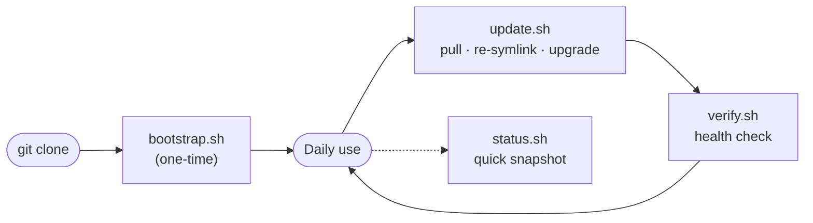

# Usage & lifecycle

This is the day-to-day guide for living with these dotfiles: cloning a fresh
machine, keeping it current, and checking its health. Every command and flag
below maps to a real script in the repo.

## The lifecycle at a glance

```sh
git clone https://github.com/bradbergeron-us/dotfiles.git ~/dotfiles
bash ~/dotfiles/bootstrap.sh        # one-time: install everything, symlink dotfiles
bash ~/dotfiles/update.sh           # routine: pull, re-symlink, upgrade, verify
bash ~/dotfiles/verify.sh           # on demand: full health check
bash ~/dotfiles/scripts/status.sh   # quick read-only snapshot (alias: dotstatus)
```



| Stage | Script | When |
|-------|--------|------|
| Bootstrap | `bootstrap.sh` | Once, on a fresh Mac |
| Re-symlink | `install.sh` | Whenever symlinks change (also run by bootstrap/update) |
| Update | `update.sh` | Routinely, or daily via the scheduler |
| Verify | `verify.sh` | On demand, and automatically at the end of every update |
| Status | `scripts/status.sh` | Anytime — fast, read-only |

## First run: clone + bootstrap

```sh
git clone https://github.com/bradbergeron-us/dotfiles.git ~/dotfiles
bash ~/dotfiles/bootstrap.sh
```

`bootstrap.sh` runs the full fourteen-step setup: Xcode Command Line Tools,
Homebrew, packages (`brew bundle`), fzf integration, an SSH signing key, GitHub
CLI auth, mise runtimes, Yarn via Corepack, Rust via rustup, git-lfs, dotfile
symlinks (it calls `install.sh`), optional work configs, and macOS defaults.

### The profile picker

On a genuine first run — no `--profile` flag, no `DOTFILES_PROFILE` env var, no
saved profile file, an interactive terminal, and not a dry-run — bootstrap
prompts you to pick a machine profile:

```text
  1) personal  (default) — full GUI Mac: core + GUI apps/casks + macOS defaults
  2) work                — personal plus the work overlay & work configs
  3) minimal             — core CLI + runtimes + core dotfiles only
  4) server              — headless macOS: core CLI + runtimes, no GUI
```

Pressing Enter (or anything non-interactive/CI) defaults to `personal`. The
choice is persisted to `~/.config/dotfiles/profile` so `update.sh`, `verify.sh`,
and `status.sh` all agree on this machine's profile later. To skip the prompt,
pass the profile up front:

```sh
bash ~/dotfiles/bootstrap.sh --profile work
```

### Bootstrap flags

```sh
bash ~/dotfiles/bootstrap.sh --dry-run         # preview every step; change nothing
bash ~/dotfiles/bootstrap.sh --skip-preflight  # skip the pre-flight system checks
bash ~/dotfiles/bootstrap.sh --profile minimal # choose a profile non-interactively
bash ~/dotfiles/bootstrap.sh --help            # full usage
```

- `--dry-run` previews each step (and the components the resolved profile would
  set up) without making changes. In dry-run mode the profile is **not**
  persisted and the picker does not appear.
- `--skip-preflight` bypasses `scripts/preflight.sh`. Not recommended.

See [Dry-Run & Pre-flight](DRY_RUN_AND_PREFLIGHT.md) for a deeper dive.

### Pre-flight checks

Unless you pass `--skip-preflight` (or `--dry-run`), bootstrap runs
`scripts/preflight.sh` first to validate the system before touching anything. It
checks the OS and version, CPU architecture (and Rosetta 2 on Apple Silicon),
free disk space, internet connectivity, Xcode CLI Tools, conflicting package
managers (MacPorts/Fink), the existing Homebrew install, the default shell,
write permissions, SIP, existing dotfiles, Git configuration, and dotfiles
repository integrity (conflict markers / parseable git config).

Its exit code drives bootstrap's behavior:

- `0` — all checks passed, bootstrap continues.
- `1` — critical errors; bootstrap aborts (fix them, or `--skip-preflight`).
- `2` — warnings only; bootstrap prompts to continue (auto-continues after 10s).

You can run it standalone, optionally treating warnings as errors:

```sh
bash ~/dotfiles/scripts/preflight.sh
bash ~/dotfiles/scripts/preflight.sh --strict   # warnings become a failure (exit 1)
```

## Symlinks: install.sh

```sh
zsh ~/dotfiles/install.sh
```

`install.sh` is idempotent — safe to re-run anytime. It reads
`config/symlinks.map` (the single source of truth shared by `install.sh`,
`verify.sh`, `bootstrap --dry-run`, and CI) and, for each record that applies to
the active profile, creates the symlink into `$HOME`. Records tagged for other
profiles are skipped.

For each link it reports one of: **current** (already points where it should),
**linked** (created/updated), **backed up** (an existing real file was moved
aside first), or **skip** (not in this profile). The run ends with a
`linked · current · backed up · skipped` tally.

### Backups

When a real file or a differently-targeted symlink is already at a destination,
it is moved into a timestamped backup directory before the new link is created:

```text
~/.dotfiles_backup/YYYYMMDD_HHMMSS/
```

Nothing is overwritten in place, so re-running `install.sh` never loses data.

### The ~/.gitconfig thin include

`~/.gitconfig` is deliberately **not** a symlink. `install.sh` writes a small
real file that `[include]`s the tracked config:

```ini
[include]
	path = /Users/you/dotfiles/home/gitconfig
```

Keeping it a real file means `git config --global …` and tools like
`gh auth setup-git` write into `~/.gitconfig` (after the include, so they
override the shared defaults) instead of mutating the tracked repo file. If
`~/.gitconfig` already contains this include, `install.sh` leaves it as
**current**; otherwise it backs up any existing file and regenerates the thin
include. `install.sh` also seeds `~/.config/git/local.gitconfig` and a global
pre-commit hook on first run.

## Keeping current: update.sh

```sh
bash ~/dotfiles/update.sh
```

`update.sh` runs seven steps in order and is safe to run anytime:

1. **Dotfiles** — `git pull --rebase --autostash`.
2. **Symlinks** — re-runs `install.sh` to pick up new/moved links.
3. **Homebrew** — `brew update && upgrade && autoremove && cleanup --prune=7`.
4. **Runtimes (mise)** — `mise upgrade`.
5. **Rust** — `rustup update`.
6. **Ruby gems** — `gem update --system` (plus `uv tool upgrade --all`).
7. **Health check** — runs `verify.sh`.

Steps are self-healing: an individual failure never aborts the run. Failed steps
are collected and reported in the summary banner and recorded to the status file
(see [Where state lives](#where-state-lives)).

### Safety flags

```sh
bash ~/dotfiles/update.sh --dry-run      # preview every action; change nothing
bash ~/dotfiles/update.sh --no-upgrade   # pull + re-symlink + verify only
bash ~/dotfiles/update.sh --no-pull      # skip the git pull
bash ~/dotfiles/update.sh --force-pull   # pull even if the working tree is dirty
bash ~/dotfiles/update.sh --help         # full usage
```

- `--dry-run` — prints each intended action; writes no status file and sends no
  notification.
- `--no-upgrade` — skips the brew/mise/rustup/gem upgrade steps. Ideal for work
  machines with version-pinned tooling.
- `--no-pull` — skips the git pull and works against the current checkout.
- `--force-pull` — overrides the dirty-tree guard described below. (Flag only —
  there is no config/env equivalent.)

### The dirty-tree pull guard

If the dotfiles working tree has uncommitted changes, `update.sh` **skips the
pull** rather than risk a rebase conflict, and tells you to commit/stash (or
re-run with `--force-pull`). The rest of the update still runs. If a forced pull
hits a rebase conflict, the in-progress rebase is aborted automatically and the
repo is left as it was before the pull.

### Per-machine defaults: update.conf

`NO_UPGRADE` and `NO_PULL` can be set persistently in
`~/.config/dotfiles/update.conf`:

```sh
mkdir -p ~/.config/dotfiles
cp ~/dotfiles/home/examples/update.conf.example ~/.config/dotfiles/update.conf
```

```ini
# ~/.config/dotfiles/update.conf
NO_UPGRADE=true
NO_PULL=false
```

`update.sh` reads this file **directly** on every run, so it also applies to the
scheduled launchd job (which never sources `~/.zshrc`). Booleans accept
`true/false`, `yes/no`, `on/off`, and `1/0`.

**Precedence (lowest to highest): config file < environment < command-line
flags.** The matching environment variables are `DOTFILES_UPDATE_NO_UPGRADE` and
`DOTFILES_UPDATE_NO_PULL`. So a flag always wins, an env var overrides the
config file, and the config file is the baseline.

## Health check: verify.sh

```sh
bash ~/dotfiles/verify.sh
```

`verify.sh` is a read-only health check covering nine areas:

1. **Symlinks** — broken/missing links (the only category that is an *error*).
2. **Required tools** — expected CLIs are on `PATH`.
3. **Stale backups** — `~/.dotfiles_backup` entries older than 30 days.
4. **SSH key** — present and loaded in the agent.
5. **git-lfs** — installed and initialized globally.
6. **mise tools** — declared runtimes are installed.
7. **Dotfiles git health** — no conflict markers; git config parses cleanly.
8. **Brewfile drift** — installed packages match the Brewfile(s) for the profile.
9. **Git config include** — `~/.gitconfig` includes the tracked config and isn't
   a symlink.

Broken symlinks make `verify.sh` exit `1`; everything else is a non-blocking
warning (exit `0`). It runs automatically as the last step of every `update.sh`.

## Quick snapshot: status.sh

```sh
bash ~/dotfiles/scripts/status.sh          # repo state + last-update summary
dotstatus                                  # the same, via the shell alias
bash ~/dotfiles/scripts/status.sh --verify    # also run the full verify.sh
bash ~/dotfiles/scripts/status.sh --exit-code  # non-zero exit if unhealthy
bash ~/dotfiles/scripts/status.sh --help
```

`status.sh` is a fast, read-only report: the active profile, the dotfiles repo's
git state (branch, dirty/clean, untracked count, ahead/behind), and the result
of the last `update.sh` run (read from `logs/update.status`).

- `--verify` additionally runs the full `verify.sh` health check.
- `--exit-code` makes the command exit non-zero when unhealthy (the last update
  failed, or `--verify` reported problems) — useful in scripts and CI. Without
  it, `status.sh` is a pure report and always exits `0`.

## Scheduling daily updates: setup-scheduler.sh

```sh
bash ~/dotfiles/scripts/setup-scheduler.sh              # install: runs daily at 9 AM
bash ~/dotfiles/scripts/setup-scheduler.sh --no-upgrade # install; scheduled run skips upgrades
bash ~/dotfiles/scripts/setup-scheduler.sh --no-pull    # install; scheduled run skips git pull
bash ~/dotfiles/scripts/setup-scheduler.sh --uninstall  # remove the scheduled job
bash ~/dotfiles/scripts/setup-scheduler.sh --help
```

This installs a launchd agent
(`~/Library/LaunchAgents/com.dotfiles.update.plist`) that runs `update.sh` once
a day at 9 AM, appending output to `logs/update.log`. Install is idempotent — an
existing job is unloaded and reloaded.

`--no-upgrade` / `--no-pull` are **baked into the plist's `ProgramArguments`**,
so the scheduled job runs e.g. `update.sh --no-upgrade`. For a default that also
applies to *manual* runs, prefer setting `NO_UPGRADE=true` in
`~/.config/dotfiles/update.conf` instead (the launchd job honors it too, since
`update.sh` reads that file directly).

## Where state lives

Update runs leave two files in `~/dotfiles/logs/`:

- **`logs/update.status`** — a small key/value summary written after every run:
  `last_run` timestamp, overall `status` (success/failure), any `failed_steps`,
  and `duration_seconds`. This is what `status.sh` reads. (Not written during
  `--dry-run`.)
- **`logs/update.log`** — stdout/stderr from the scheduled launchd job. It is
  auto-rotated copytruncate-style at the start of a run once it exceeds
  `DOTFILES_LOG_MAX_BYTES` (default 1 MiB), keeping `DOTFILES_LOG_KEEP` rotated
  copies (default 5: `update.log.1` … `update.log.5`).

On failure, `update.sh` also posts a macOS notification (skipped in CI/headless
contexts).

## See also

- [Dry-Run & Pre-flight](DRY_RUN_AND_PREFLIGHT.md) — previewing and validating before installing.
- [Encrypted Secrets](secrets.md) — managing secrets with sops + age.
- [Tool Reference](tools.md) — every tool in the Brewfile, with rationale.
- [Troubleshooting](troubleshooting.md) — fixes for failed updates, broken symlinks, and more.
- [Recover from a failed update](how-to/recover-from-a-failed-update.md) — the step-by-step recovery guide.
